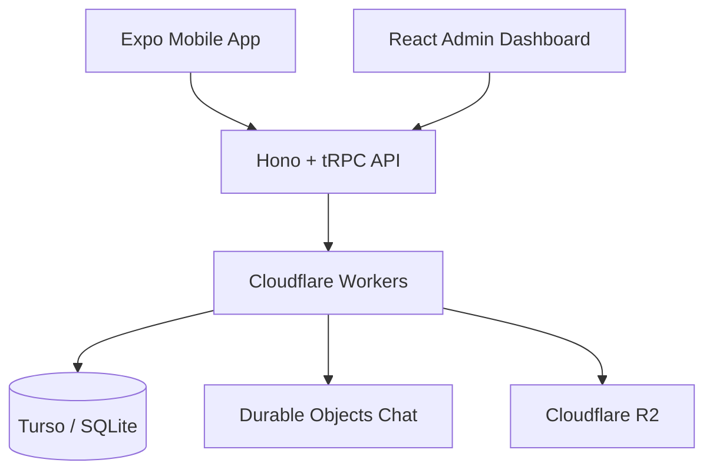

# Hi, I'm Ibrahim Rahmani 👋

### Software Engineering Student · Full-Stack Developer · AI & IoT Enthusiast

I build modern web and mobile applications, scalable backends, and connected systems.

---

## About Me

I am a Computer Engineering student at **ENSA Khouribga**, specializing in **Advanced Software Technologies**. I am passionate about designing useful digital products and developing complete solutions, from mobile and web interfaces to APIs, databases, cloud infrastructure, and IoT devices.

- 🎓 Computer Engineering — ENSA Khouribga, 2024–2027
- 📍  Based in Morocco 🇲🇦
- 🔭 Currently developing **10in**, a social mobile platform for amateur football
- 🌱 Learning more about cloud-native systems, Edge computing, AI, and software architecture
- 🤝 Open to internships, software engineering opportunities, and collaborations
- 💬 Ask me about React, React Native, Hono, Spring Boot, Laravel, Django, or IoT

## Featured Project — 10in ⚽

**10in** is a social mobile application designed for amateur football players. It helps users discover nearby matches, join games, view participants, communicate in real time, and manage their football profile.

### Main Features

- Authentication by phone number or email using OTP
- Player onboarding with name, city, profile photo, and notification preferences
- Nearby match discovery and detailed match information
- Match creation, participation, cancellation, and organizer tools
- Support for 5v5, 7v7, 9v9, and 11v11 formats
- Real-time match chat using WebSockets and Cloudflare Durable Objects
- Push notifications and automated scheduled tasks
- Player profiles, friends, match history, and badges
- Administration dashboard for users, matches, formats, and platform settings

### 10in Technical Stack

| Layer | Technologies |
| --- | --- |
| Mobile | Expo, React Native, Expo Router, TypeScript |
| Admin Dashboard | React, Vite, TanStack, TypeScript |
| Backend | Hono, tRPC, Cloudflare Workers |
| Authentication | Better Auth, OTP authentication |
| Database | SQLite, Turso, Drizzle ORM |
| Real-time | WebSockets, Cloudflare Durable Objects |
| Storage | Cloudflare R2 |
| Notifications | Push notifications, scheduled Cloudflare Cron tasks |
| Monorepo | pnpm Workspaces, Turborepo |
| Quality & Tooling | TypeScript, ESLint, Git, GitHub |

> The project follows a modular monorepo architecture that shares TypeScript types and business logic across the mobile application, administration dashboard, API, authentication, database, chat, and notification packages.

---

## Tech Stack

### Languages

### Frontend & Mobile

### Backend & APIs

### Database, Cloud & DevOps

### Tools, Data & Methods

`REST APIs` · `WebSockets` · `Agile Scrum` · `Design Thinking` · `Clean Architecture`

---

## Other Projects

### 🚿 Domestic Water Monitoring System

Connected IoT solution developed during my internship at **ONEE Errachidia** to monitor domestic water consumption and detect anomalies.

- **Stack:** Python, Django, React, MySQL, ESP32, YF-S201 sensors
- Real-time collection and visualization of water consumption data
- Automatic anomaly detection and intelligent alerts

### 🛍️ Ready-to-Wear E-commerce Platform

Full e-commerce platform with separate customer and seller experiences.

- **Stack:** Laravel, PHP, JavaScript, MySQL
- Product, order, customer, and seller management
- MVC architecture, validation, and application security practices

### 🏥 Medical Practice Management

Full-stack system for managing the daily operations of a medical practice.

- **Stack:** Spring Boot, React, Java/JEE, MySQL
- Patients, appointments, medical records, prescriptions, and billing
- Role-based access control and permission management

---

## GitHub Analytics

---

## Education & Involvement

- 🎓 **Computer Engineering Cycle** — ENSA Khouribga, 2024–2027
- 📚 **DEUST MIP** — Mathematics, Computer Science, and Physics, FST Errachidia
- 🎨 **Head of Design & Media Unit** — JLM ENSA Khouribga
- 🌍 **Languages:** Arabic (native), French (fluent), English (B2)

---

## Let's Connect

I am open to internships, software engineering opportunities, open-source contributions, and ambitious technical collaborations. If you are working on a web, mobile, AI, cloud, or IoT project, feel free to contact me.

### Thanks for visiting my profile! ⭐

